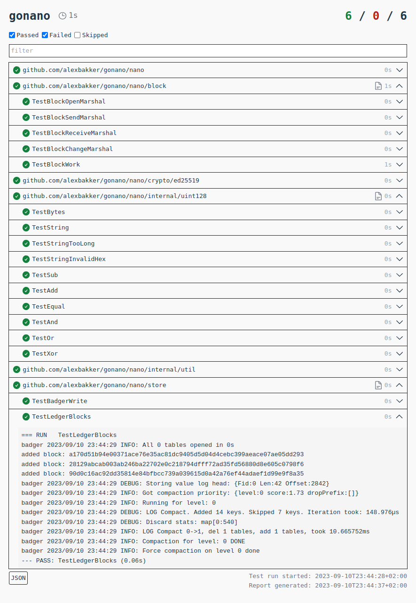

# gotchet [](https://github.com/alexbakker/gotchet/actions/workflows/build.yml) [](https://hub.docker.com/r/alexanderbakker/gotchet/tags)

__gotchet__ is a test report tool for Go. It can display test results in a TUI
and generate HTML reports. Its primary purpose is to make it a bit easier to
analyze results of large long-running test suites that make use of subtests and
have lots of log output.

Current status: __WIP__.

## Usage

Use one of the following commands to get the right
[test2json](https://pkg.go.dev/cmd/test2json) output from your Go tests:

For ``go test``:

```
go test -json -v=test2json ./...
```

For test binaries (``go test -c``):

```
go tool test2json -t -p pkgname ./test-binary -test.v=test2json
```

Pipe the output to gotchet to generate an HTML report

```
go test -json -v=test2json ./... | gotchet gen > report.html
```

## Screenshot


